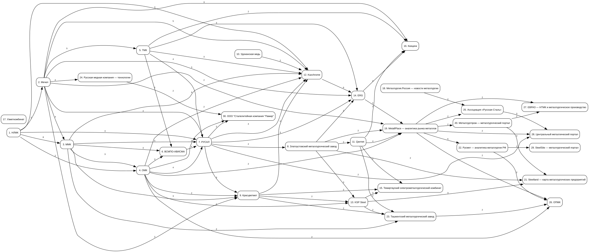

# Лабораторная работа №2 --- Граф информационных ресурсов

## Цель

Построить граф информационных ресурсов по тематике металлургии на основе
сходства ключевых терминов, извлечённых с веб-страниц.

## Что реализовано

-   собрано **30 информационных ресурсов** России и стран ближнего
    зарубежья;
-   получение веб-страниц с помощью `requests`;
-   извлечение текста из `h1-h6`, `p` и `li` с помощью BeautifulSoup;
-   выделение ключевых терминов с помощью `rutermextract`;
-   попарное сравнение множеств терминов;
-   построение связи между двумя ресурсами, если они имеют не менее
    заданного количества общих терминов;
-   визуализация графа с помощью Graphviz;
-   сохранение результата в форматах DOT и SVG.

## Параметры построения

В итоговом запуске использован порог:

``` text
N = 2
```

То есть ребро между двумя ресурсами создаётся, если между ними найдено
**не менее двух общих ключевых терминов**.

## Результат

По итогам запуска:

-   ресурсов в списке --- **30**;
-   успешно обработано --- **30**;
-   ресурсов с ошибками --- **0**;
-   ресурсов с выделенными терминами --- **30**;
-   рёбер графа --- **74**.

## Граф информационных ресурсов



Граф автоматически формируется `src/main.py`.
Толщина/значение связи соответствует количеству общих терминов между
ресурсами.

## Структура проекта

``` text
LR2_MetallurgyGraph_Danilov/
├── data/
│   └── resources.csv
├── results/
│   ├── graph.dot
│   └── metallurgy_graph.svg
├── src/
│   └── main.py
├── requirements.txt
├── run.ps1
└── README.md
```

## Установка

Создать виртуальное окружение:

``` powershell
python -m venv --system-site-packages .venv
```

Установить Python-зависимости:

``` powershell
.\.venv\Scripts\python.exe -m pip install -r requirements.txt
```

Для построения SVG также требуется установленный **Graphviz**. Проверить
его наличие можно командой:

``` powershell
dot -V
```

## Запуск

Из корневого каталога проекта:

``` powershell
.\run.ps1
```

или напрямую:

``` powershell
.\.venv\Scripts\python.exe .\src\main.py --threshold 2
```

После выполнения программа обновляет результаты в каталоге `results/`.

## Результаты работы программы

`graph.dot` содержит описание графа в формате Graphviz DOT.

`metallurgy_graph.svg` содержит визуальное представление построенного
графа и используется в этом README.
