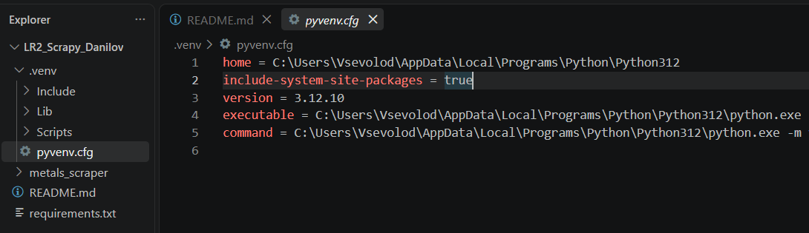

# Практическая работа по Scrapy

## Цель
Изучить базовые возможности Scrapy и реализовать паука для краулинга сайта
с переходом по пагинации и сохранением результатов.

## Что реализовано
- отдельный проект Scrapy;
- Spider с `name` и `start_urls`;
- метод `parse`;
- CSS-селекторы;
- извлечение нескольких полей;
- `yield` для передачи элементов Scrapy;
- переход по пагинации через `response.follow`;
- абсолютные URL;
- обработка отсутствующих элементов;
- сохранение результатов в JSON и CSV;
- ограничение числа страниц параметром `CLOSESPIDER_PAGECOUNT`;
- статистика выполнения Scrapy.

## Выбор источника данных

В задании конкретный сайт не был указан, поэтому я выбрал учебный сайт
Books to Scrape, специально предназначенный для практики веб-скрейпинга.
На нём есть много страниц каталога, поэтому на нём удобно продемонстрировать
CSS-селекторы и автоматическую пагинацию.

Источник данных: https://books.toscrape.com/

## Установка на Windows

Создать отдельное виртуальное окружение:

```powershell
python -m venv --system-site-packages .venv
```

Параметр `--system-site-packages` автоматически создаёт виртуальное окружение
с настройкой:

```text
include-system-site-packages = true
```

То есть параметр `true` не нужно устанавливать вручную — он задаётся
при создании `.venv`.

Активировать окружение:

```powershell
.venv\Scripts\activate
```

Установить зависимости:

```powershell
pip install -r requirements.txt
```

По заданию из лекции используется отдельный `venv` с
`include-system-site-packages = true` в `.venv\pyvenv.cfg`.

Пример настройки:



## Запуск

1. Перейти в директорию Scrapy-проекта:

```powershell
cd .\LR2_Scrapy_Danilov\metals_scraper
```

2. Запустить Spider с сохранением результата в JSON:

```powershell
scrapy crawl books -O output.json
```

3. Для сохранения результата в CSV:

```powershell
scrapy crawl books -O output.csv
```

4. Ограничить обход, например, одной страницей:

```powershell
scrapy crawl books -s CLOSESPIDER_PAGECOUNT=1 -O output.json
```

> Команды `scrapy crawl` необходимо выполнять из каталога `metals_scraper`, где находится файл `scrapy.cfg`.

## Результат

Каждая запись содержит:
- `title` — название книги;
- `price` — цена;
- `availability` — наличие;
- `rating` — рейтинг;
- `url` — ссылка на страницу товара.

Пауку разрешено переходить по ссылке следующей страницы, поэтому он
обходит не только первую страницу.

## Проверка

После запуска в каталоге проекта должны появиться:
- `output.json` или `output.csv`;
- в консоли — сообщения Scrapy и итоговая статистика.

