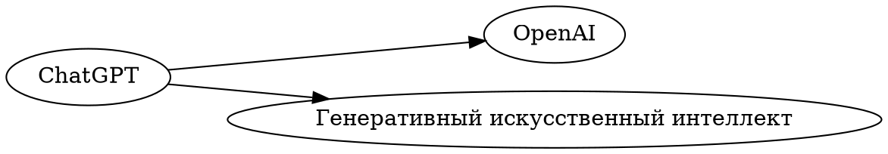
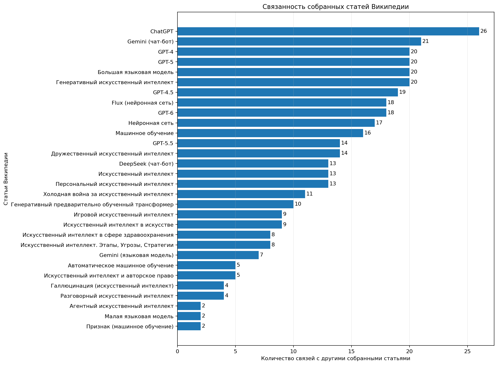

# Лабораторная работа №3 — Wikimedia API

## Тема

**Автоматизированный сбор данных из экосистемы Wikimedia через API.**

Лабораторная работа посвящена работе с реальным API MediaWiki и автоматизированному извлечению структурированных данных из основных проектов Wikimedia.

В соответствии с заданием приложение:

- принимает запрос о предметной области;
- автоматически собирает статьи Википедии;
- получает связанные гиперссылки;
- получает данные из Викиданных;
- выполняет поиск изображений в Wikimedia Commons;
- получает данные из Викисловаря;
- формирует итоговую JSON-структуру;
- строит граф связей в формате DOT минимум для 30 статей;
- получает актуальную **Picture of the Day** из Wikimedia Commons;
- сохраняет описание картинки дня в текстовый файл;
- строит график статистики связей;
- автоматически проверяет выполнение основных требований лабораторной работы.

---

## 1. Предметная область

В качестве предметной области используется:

```text
искусственный интеллект
```

Количество собираемых статей:

```text
30
```

Выбор статей выполняется автоматически. Программа не использует заранее заданный список страниц.

Для повышения тематической релевантности используются несколько поисковых запросов:

```text
искусственный интеллект
машинное обучение
нейронная сеть
генеративный искусственный интеллект
большая языковая модель
```

Полученные кандидаты объединяются, после чего для них рассчитывается тематический балл.

При ранжировании учитываются:

- совпадения тематических терминов в названии статьи;
- совпадения тематических терминов в кратком описании;
- наличие ключевых терминов, непосредственно связанных с ИИ;
- позиция статьи в результатах поиска.

Также исключаются явно нерелевантные результаты: страницы-значения, списки, фильмы, песни, социальные сети, спортивные объекты, транспорт и другие страницы, не относящиеся непосредственно к предметной области.

После ранжирования выбираются 30 наиболее релевантных статей.

---

## 2. Требования

### Программное обеспечение

Рекомендуется:

- Python 3.10 или новее;
- доступ к сети Интернет;
- Windows, Linux или macOS.

### Используемые библиотеки

Установить зависимости:

```bash
pip install requests matplotlib
```

Проверить установленную версию Python:

```bash
python --version
```

---

## 3. Запуск программы

В каталоге проекта должны находиться:

```text
lab3_wikimedia_api.py
README.md
```

Запуск:

```bash
python lab3_wikimedia_api.py
```

В Windows PowerShell также можно использовать:

```powershell
python .\lab3_wikimedia_api.py
```

После запуска программа последовательно выполняет шесть этапов.

---

## 4. Этапы работы программы

### [1/6] Сбор статей Википедии

Сначала программа выполняет несколько поисковых запросов к русской Википедии.

Полученные результаты объединяются и фильтруются. Для каждого кандидата рассчитывается тематический балл.

После этого выбираются 30 наиболее подходящих статей.

Для каждой выбранной статьи дополнительно получаются:

- идентификатор страницы;
- URL;
- краткое текстовое содержимое;
- идентификатор соответствующей сущности Wikidata;
- список внутренних ссылок на другие статьи.

Ссылки для каждой статьи запрашиваются отдельным обращением к API. Это позволяет получить до 100 ссылок для каждой страницы и не распределять общий лимит `pllimit` между несколькими страницами.

Программа также обрабатывает HTTP 429 (**Too Many Requests**) с использованием повторной попытки после ожидания, указанного сервером.

---

### [2/6] Получение данных Wikidata

Для найденных статей используются связанные идентификаторы Wikidata.

Из Wikidata извлекаются:

- идентификатор сущности;
- название на русском языке;
- название на английском языке;
- описание на русском языке;
- количество языковых ссылок.

Полученные сведения сохраняются в итоговый JSON.

---

### [3/6] Поиск изображений Wikimedia Commons

В Wikimedia Commons выполняется поиск по исходному запросу предметной области.

Для найденных файлов сохраняются:

- название файла;
- URL изображения;
- описание изображения.

В текущем запуске было найдено 5 файлов.

---

### [4/6] Получение данных Викисловаря

Дополнительно выполняется запрос к русскому Викисловарю для термина:

```text
искусственный
```

Сохраняются:

- название страницы;
- идентификатор страницы;
- URL;
- текстовое описание.

---

### [5/6] Построение графа связей

На основе собранных статей формируется ориентированный граф.

Каждая выбранная статья является узлом графа.

Ребро:

```text
Статья A → Статья B
```

создаётся, если в статье A присутствует внутренняя ссылка на статью B, и обе статьи входят в выбранные 30 страниц.

Граф сохраняется в формате **DOT**, который можно открыть с помощью Graphviz и других программ для визуализации графов.

Дополнительно строится график количества связей для каждой статьи средствами `matplotlib`.

---

### [6/6] Проверка требований

После формирования результатов программа автоматически проверяет:

- наличие 30 статей;
- наличие JSON;
- наличие данных Wikipedia;
- наличие данных Wikidata;
- наличие данных Wikimedia Commons;
- наличие данных Викисловаря;
- получение Picture of the Day;
- наличие DOT-файла;
- наличие 30 узлов графа;
- наличие рёбер графа.

В конце выводится итог:

```text
Проверки: ВСЕ ПРОЙДЕНЫ
```

---

## 5. Picture of the Day

Программа автоматически определяет текущую **Picture of the Day** Wikimedia Commons.

Для картинки сохраняются:

- название файла;
- URL источника;
- URL изображения;
- описание.

Описание сохраняется в отдельный текстовый файл с именем, соответствующим имени файла изображения.

Пример:

```text
NE_Lac_Bab_Louta_Tazekka_Nov25_A7CR_09270-4_HDR1.jpg.txt
```

URL самого изображения также сохраняется в поле `image_url` итогового JSON.

---

## 6. Результаты работы

После выполнения программы создаётся каталог:

```text
wikimedia_lab3_output/
```

Основные файлы:

```text
wikimedia_lab3_output/
├── wikimedia_result.json
├── wikimedia_graph.dot
├── links_statistics.png
└── <Picture_of_the_Day>.jpg.txt
```

---

## 7. Итоговый JSON

Файл:

```text
wikimedia_result.json
```

содержит всю собранную информацию.

Основные разделы:

```text
metadata
wikipedia
wikidata
wikimedia_commons
wiktionary
graph
picture_of_the_day
```

### `metadata`

Содержит общую информацию о запуске:

```json
{
  "laboratory": "Лабораторная работа №3",
  "subject_area": "искусственный интеллект",
  "article_limit": 30,
  "articles_collected": 30
}
```

### `wikipedia`

Содержит выбранные статьи Википедии.

Для статьи сохраняются:

```text
title
pageid
url
extract
links
images
wikidata_id
```

### `wikidata`

Содержит найденные сущности Wikidata и их основные характеристики.

### `wikimedia_commons`

Содержит результаты поиска изображений Wikimedia Commons.

### `wiktionary`

Содержит данные страницы Викисловаря.

### `picture_of_the_day`

Содержит данные актуальной картинки дня.

### `graph`

Содержит узлы и ориентированные рёбра:

```json
{
  "nodes": [...],
  "edges": [
    {
      "source": "Статья A",
      "target": "Статья B"
    }
  ]
}
```

---

## 8. Граф DOT

Файл:

```text
wikimedia_graph.dot
```

содержит описание графа в формате DOT.

Пример структуры:



Для просмотра графа можно использовать Graphviz.

Если Graphviz установлен в системе, PNG можно получить командой:

```bash
dot -Tpng wikimedia_lab3_output/wikimedia_graph.dot -o graph.png
```

Сам файл DOT уже является самостоятельным результатом лабораторной работы.

---

## 9. График связности статей

Результат визуализации количества связей между собранными статьями:



создаётся средствами `matplotlib`.

По вертикальной оси отображаются названия выбранных статей Википедии.

По горизонтальной оси:

```text
Количество связей с другими собранными статьями
```

Учитываются только связи между статьями, которые вошли в итоговую выборку из 30 страниц.

---

## 10. Результат последнего запуска

Для текущей версии программы был получен следующий результат:

| Показатель | Результат |
|---|---:|
| Собрано статей | 30 |
| Узлов графа | 30 |
| Рёбер графа | 184 |
| Сущностей Wikidata | 30 |
| Файлов Wikimedia Commons | 5 |
| Викисловарь | получен |
| Picture of the Day | получена |
| JSON | создан |
| DOT | создан |
| График | создан |
| Проверка требований | **ВСЕ ПРОЙДЕНЫ** |

Выборка из 30 статей в последнем запуске включает, в частности:

```text
Генеративный искусственный интеллект
Gemini (языковая модель)
Большая языковая модель
Разговорный искусственный интеллект
Искусственный интеллект
Искусственный интеллект и авторское право
DeepSeek (чат-бот)
Генеративный предварительно обученный трансформер
Персональный искусственный интеллект
ChatGPT
Gemini (чат-бот)
GPT-4
GPT-4.5
GPT-5.5
GPT-6
Нейронная сеть
Агентный искусственный интеллект
Дружественный искусственный интеллект
Искусственный интеллект в сфере здравоохранения
...
```

Таким образом, итоговая выборка содержит как общие понятия искусственного интеллекта, так и конкретные современные модели, методы и направления.

---

## 11. Обработка ограничений API

Wikimedia API может возвращать HTTP 429 при слишком частых запросах.

В программе предусмотрена обработка этого случая:

1. определяется ответ `429`;
2. программа получает значение `Retry-After`;
3. выполняется ожидание;
4. запрос повторяется;
5. после успешного ответа программа продолжает работу.

Также между успешными запросами предусмотрена небольшая задержка:

```python
time.sleep(0.45)
```

Это снижает вероятность слишком частых обращений к API.

---

## 12. Структура проекта

```text
LR3_Wikipedia_Api_Danilov/
│
├── lab3_wikimedia_api.py
├── README.md
│
└── wikimedia_lab3_output/
    ├── wikimedia_result.json
    ├── wikimedia_graph.dot
    ├── links_statistics.png
    └── <Picture_of_the_Day>.jpg.txt
```

---

## 13. Используемые API

В проекте используются следующие точки доступа MediaWiki API:

### Русская Википедия

```text
https://ru.wikipedia.org/w/api.php
```

Используется для:

- поиска статей;
- получения содержимого;
- получения внутренних ссылок.

### Викиданные

```text
https://www.wikidata.org/w/api.php
```

Используется для получения информации о связанных сущностях.

### Wikimedia Commons

```text
https://commons.wikimedia.org/w/api.php
```

Используется для:

- поиска изображений;
- получения метаданных;
- получения Picture of the Day.

### Русский Викисловарь

```text
https://ru.wiktionary.org/w/api.php
```

Используется для получения информации о выбранном термине.

---

## 14. Соответствие заданию

| Требование | Реализация |
|---|---|
| Автоматизированный сборщик на Python | `lab3_wikimedia_api.py` |
| Входной запрос о предметной области | `QUERY = "искусственный интеллект"` |
| Wikipedia | используется API русской Википедии |
| Wikidata | используется API Wikidata |
| Wikimedia Commons | используется API Commons |
| Wiktionary | используется API Викисловаря |
| JSON | `wikimedia_result.json` |
| Статьи и текст | раздел `wikipedia` |
| Гиперссылки | поле `links` |
| Изображения | раздел `wikimedia_commons` |
| Граф связей | `wikimedia_graph.dot` |
| Минимум 30 статей | 30 узлов |
| Picture of the Day | автоматическое получение |
| Описание картинки дня | отдельный `.txt` файл |
| Автоматическая проверка | блок `[6/6]` |

---

## 15. Вывод

В результате работы реализован консольный Python-сборщик данных, взаимодействующий с основными проектами Wikimedia через MediaWiki API.

Программа автоматически формирует тематическую выборку из 30 статей по предметной области «искусственный интеллект», получает связанные данные из Wikipedia, Wikidata, Wikimedia Commons и Викисловаря, сохраняет результаты в JSON, формирует граф связей в формате DOT и выполняет дополнительное получение Picture of the Day.

Текущий запуск успешно сформировал 30 узлов и 184 связи графа, а все предусмотренные программой проверки завершились успешно.
